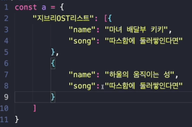
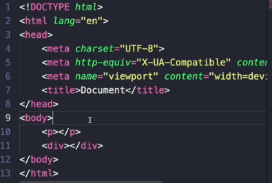
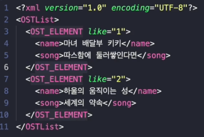

# JSON(JavaScript Object Notation)

- Javascript 객체 문법으로 구조화 된 데이터교환 형식
- Python, javascript, java 등 여러 언어에서 데이터 교환형식으로 쓰이며 객체문법 말고도 단순 배열, 문자열도 표현 가능(그러나 이러한 용도는 아님)
- 장점
    - 데이터를 간단하게 주고 받을 수 있게 하는 파일 포맷
    - 텍스트를 기반으로 해 가볍게 쓸 수 있음
    - 사람 관점에서 읽고 쓰기 좋음
    - 프로그래밍 언어/플랫폼에 상관없이 쓸 수 있음 (독립적임)

## Javascript 객체 문법
- 키(key)와 값(value)로 구성되어 있음 `{key : value}` (파이썬의 딕셔너리와 매우 유사)
- 이미 존재하는 키를 중복선언하면 제일 마지막에 선언한 해당 키에 대응한 값이 덮어쓰이게 됨 (키는 중복이 안됨)

## JSON의 직렬화
- JSON.stringify() 메서드로 JavaScript 객체를 JSON 문자열로 변환
- 외부의 시스템에서도 사용할 수 있도록 바이트 형태로 데이터를 변환하는 기술

## JSON의 역직렬화
- JSON.parse() 메서드로 JSON 문자열의 구문을 분석하고, JavaScript 객체를 생성함

## JSON의 활용
- 시스템간 데이터 교환에 많이 쓰임
- API
- 시스템을 구성하는 설정파일

---

# XML(Extensible Markup Language)

## 마크업 형태를 쓰는 데이터교환 형식
- 마크업?
    - 마크(Mark)로 둘러싸인 언어 (태그(Tag)라고도 함)
    - 문서의 골격에 해당하는 부분을 작성하는데 사용됨

## 구성
- 프롤로그 : 버전, 인코딩
- 루트요소(단 하나만)
- 하위요소들

## HTML과 XML의 차이
- HTML의 용도는 데이터를 표시하는 것. XML은 데이터를 저장 및 전송 용도.
- HTML에는 미리 정의된 태그가 있지만 사용자는 XML에서 고유한 태그를 만들고 정의 가능
- HTML은 대/소문자를 구분하지 않지만 XML은 구분함

## JSON과 XML의 차이
- JSON과 비교했을 때 닫힌 태그가 계속해서 들어가기 때문에 JSON에 비해 무거움
- 또한 Javascript Object로 변환하기 위해서 JSON보다 더 복잡한 절차를 밟아야 함 (JSON은 JSON.parse()면 됨)

## XML의 활용
- sitemap.xml으로 쓰임